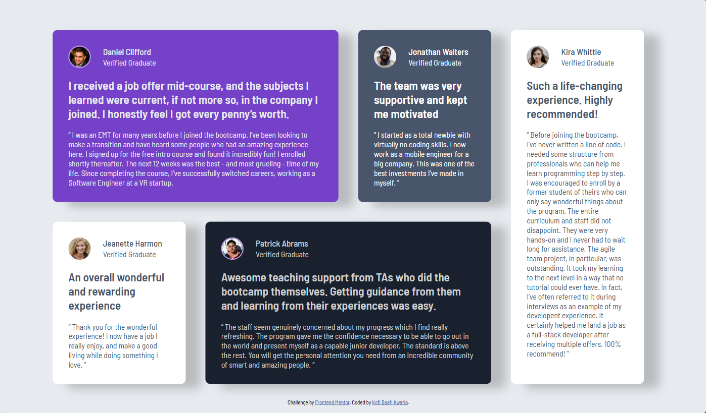

# Frontend Mentor - Testimonials grid section solution

This is my solution to the [Testimonials grid section challenge on Frontend Mentor](https://www.frontendmentor.io/challenges/testimonials-grid-section-Nnw6J7Un7). Frontend Mentor challenges help you improve your coding skills by building realistic projects.

## Table of contents

- [Overview](#overview)
  - [The challenge](#the-challenge)
  - [Screenshot](#screenshot)
  - [Links](#links)
- [My process](#my-process)
  - [Built with](#built-with)
  - [What I learned](#what-i-learned)
  - [Continued development](#continued-development)
  - [Useful resources](#useful-resources)
- [Author](#author)

## Overview

### The challenge

Users should be able to:

- View the optimal layout for the site depending on their device's screen size

### Screenshot

### Links

- Solution URL: [Github](https://github.com/WesSno/Testimonials-Grid-Section)
- Live Site URL: [Netlify](https://kbk-testimonials-section.netlify.app/)

## My process

### Built with

- Semantic HTML5 markup
- CSS custom properties
- Flexbox
- CSS Grid
- Mobile-first workflow

### What I learned

- Improved my understanding of creating responsive grid layouts that adapt seamlessly across different screen sizes and viewport widths.

### Continued development

- Add subtle animations and transitions to the cards to enhance the user experience and make interactions feel more engaging.

### Useful resources

- [Frontend Mentor](https://www.frontendmentor.io/challenges/testimonials-grid-section-Nnw6J7Un7) - provided me with some of the necessary resources to complete this project.

## Author

- Website - [Kofi Baafi Kwatia](https://github.com/WesSno)
- Frontend Mentor - [@WesSno](https://www.frontendmentor.io/profile/WesSno)
